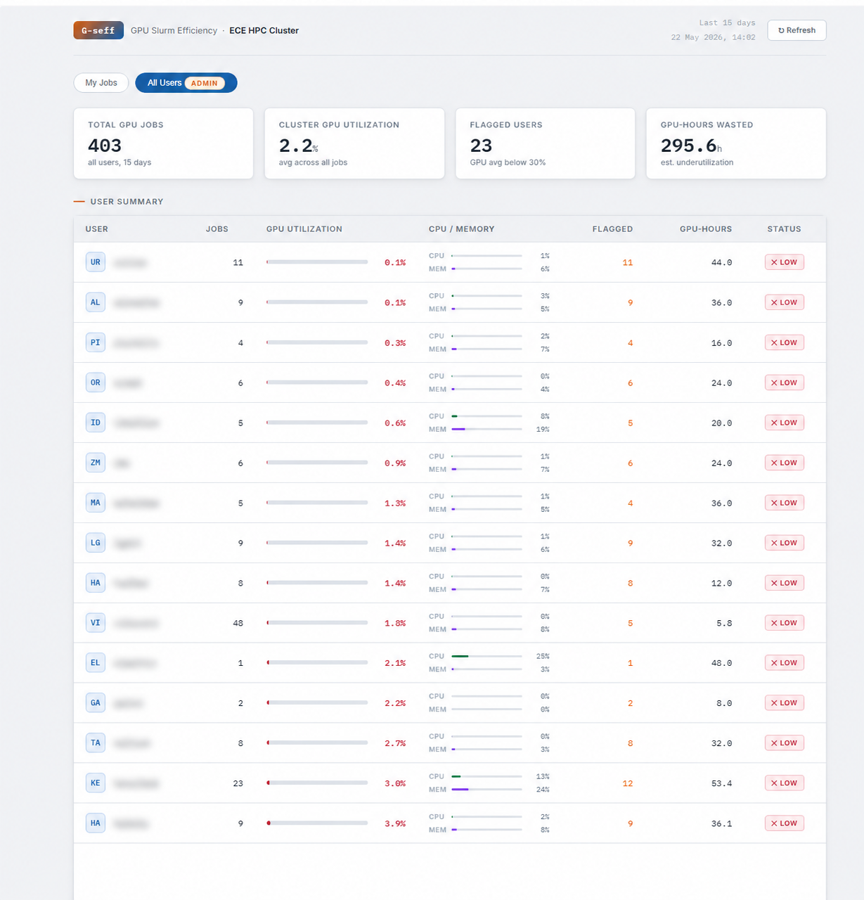

# G-seff — GPU Slurm Efficiency Reporter

A web-based GPU job efficiency reporter for HPC clusters running Slurm and OpenOnDemand.

Deployed as an OOD app for the ECE HPC Cluster at Ben-Gurion University.



## What it does

- Shows each researcher their own GPU, CPU, and memory utilization for completed jobs over the last 15 days
- Flags jobs and users with GPU utilization below 30%
- Admins (members of the `hpc_eeadmins` AD group) get an additional "All Users" view with cluster-wide efficiency stats
- GPU data from **Prometheus + DCGM exporter**, CPU/memory from **sacct**

## Stack

- **Backend:** FastAPI + uvicorn (Python 3.9)
- **Frontend:** Vanilla JS + HTML/CSS, served via Jinja2
- **Auth:** PAM via OOD Apache proxy (`X-Remote-User` header)
- **GPU metrics:** Prometheus range queries (`DCGM_FI_DEV_GPU_UTIL`)
- **CPU/Mem metrics:** `sacct` (`AveCPU`, `MaxRSS`, `ReqMem` from `.batch` step)

## Architecture

```
Browser → OOD Apache (PAM auth) → /gseff proxy → uvicorn :8766
                                                      ↓
                                              FastAPI app.py
                                            ↙            ↘
                                      sacct            Prometheus
                                  (CPU/mem/jobs)     (GPU utilization)
```

## Deployment

```bash
sudo mkdir -p /opt/gseff/templates
sudo cp app.py /opt/gseff/
sudo cp templates/gseff.html /opt/gseff/templates/

sudo python3 -m venv /opt/gseff/venv
sudo /opt/gseff/venv/bin/pip install -r requirements.txt

sudo cp gseff.service /etc/systemd/system/
sudo systemctl daemon-reload
sudo systemctl enable --now gseff
```

### OOD proxy (`/etc/ood/config/ood_portal.yml`)

```yaml
- '<Location /gseff>'
- '  AuthType Basic'
- '  AuthName "ECE HPC"'
- '  AuthBasicProvider PAM'
- '  AuthPAMService ood'
- '  Require valid-user'
- '  RequestHeader set X-Remote-User %{REMOTE_USER}e env=REMOTE_USER'
- '  ProxyPass http://127.0.0.1:8766/gseff'
- '  ProxyPassReverse http://127.0.0.1:8766/gseff'
- '</Location>'
```

Then regenerate and reload:
```bash
sudo /opt/ood/ood-portal-generator/sbin/update_ood_portal
sudo cp /etc/httpd/conf.d/ood-portal.conf.new /etc/httpd/conf.d/ood-portal.conf
sudo systemctl reload httpd
```

### OOD app tile (`/var/www/ood/apps/sys/gseff/manifest.yml`)

```yaml
---
name: "G-seff"
category: "Jobs"
subcategory: "Efficiency"
icon: "fa://chart-bar"
description: "GPU Slurm Efficiency Reporter"
url: "/gseff/"
new_window: true
```

## Configuration

Edit constants at the top of `app.py`:

| Variable | Default | Description |
|---|---|---|
| `PROMETHEUS_URL` | `http://hpc-monitor1:9090` | Prometheus host |
| `DCGM_METRIC` | `DCGM_FI_DEV_GPU_UTIL` | DCGM GPU utilization metric name |
| `EFFICIENCY_THRESHOLD` | `30` | % below which jobs are flagged |
| `ADMIN_GROUP` | `hpc_eeadmins` | AD group with admin access |
| `DAYS` | `15` | Lookback window (match Prometheus retention) |

## Related projects

- [hpc-admin-portal-demo](https://github.com/Nadavka-cmd/hpc-admin-portal-demo) — Full cluster admin portal (Slurm, LDAP, storage)
- [hpc-admin-tui](https://github.com/Nadavka-cmd/hpc-admin-tui) — Terminal UI predecessor to the portal
